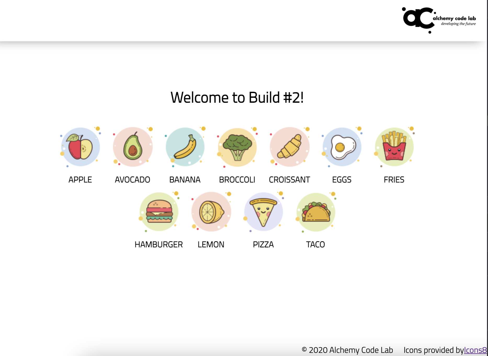

# Foundations I Build #2

## Goal: Make a list of things
Make a list of food items that look like this


Images and styling are all provided for you. You only need to add the HTML with the right class names or ids and the appropriate Javascript.

## UX Requirements (Cypress needs these elements to pass)
* A `<ul>` element with the id `#food-list`
* Import the items from `food.js`
* Loop through the food items and create an `<li>` element for each item
* Each `<li>` element should have the following:
    * An `` pointing to the asociated image in the assets folder (the path for the image is in the `img` attribute of the food item)
    * A span with the class `food-name` containing the `name` attribute of the food item
    ```html
    <li class="food-item">
        
        <span class="food-name">apple</span>
    </li>
    ```

## Events
* Loading the data and displaying the list should happen on load -- no specific events to listen for

## To Run Tests
* `npm install`
* `npm test`
* Cypress will open -- you should then click "run 1 integration spec"
    
* Make sure all tests pass